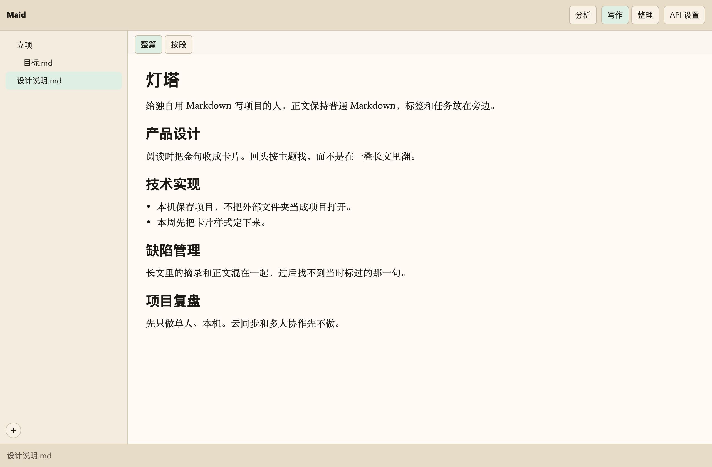
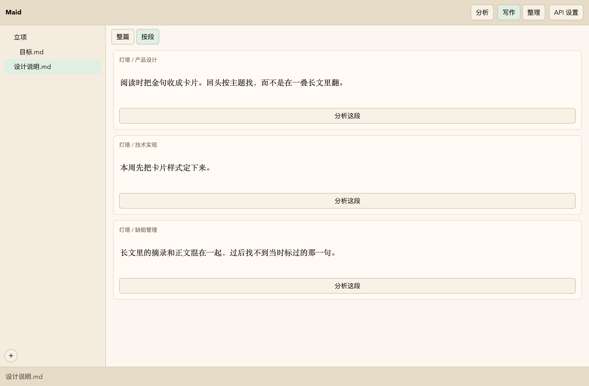
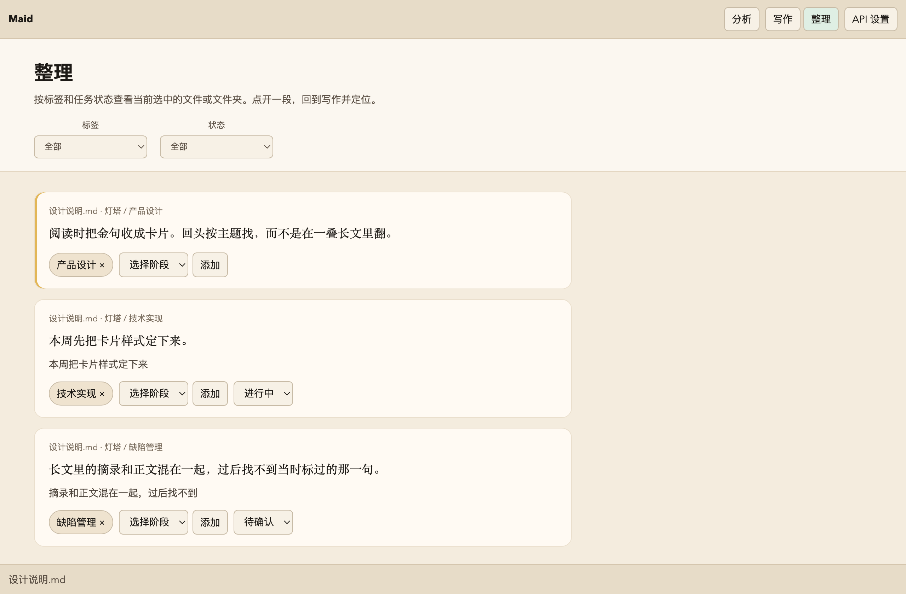
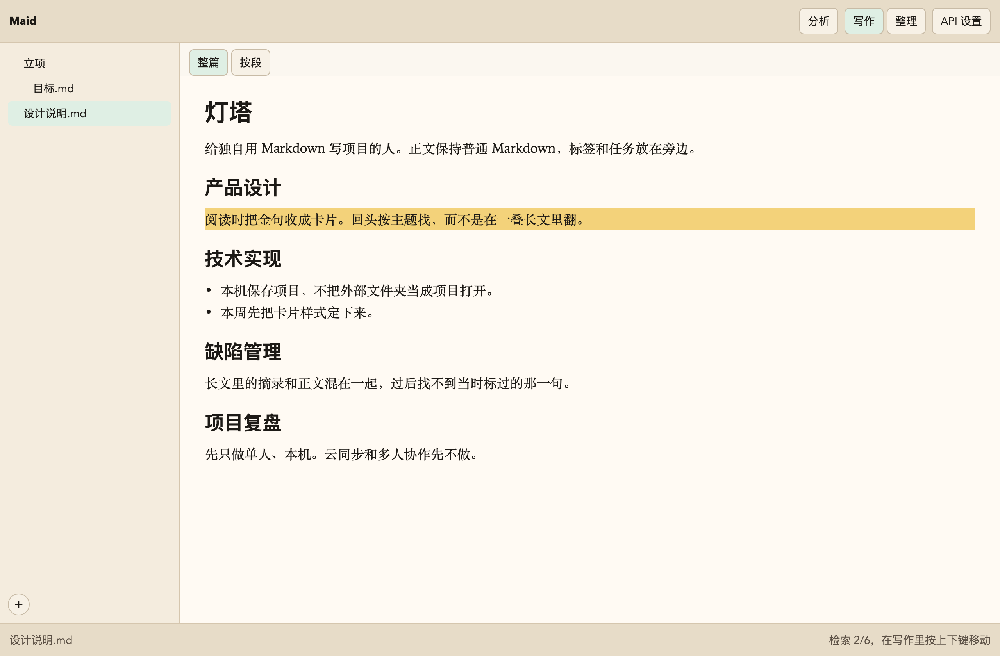

# Maid

MAID = Markdown AI Development。macOS 上的本地项目编辑器。

用自然语言把项目写在 Markdown 里。Maid 按文档结构把正文分成段，标上研发阶段，并嗅探出任务。标签和任务记在旁边的索引里，不写回原文，文件拿到别的编辑器里仍是普通 Markdown。

<p align="center">
  
</p>

## 写作

打开文档看到的是一屏已经渲染好的正文，输入和修改都发生在这一屏上。没有并列的源码区。保存到磁盘上的仍是 Markdown。

项目由 Maid 自己创建，放在应用的固定存储里。左侧文件树用来浏览、新建文件和文件夹，也可以导入、导出、改名和删除。导出的只有正文。



## 分析

分析由你手动触发。保存修改不会在后台调用模型。程序先按标题和列表把文档切开，模型只对已经切好的段打标签、判断有没有任务，不改写原文。

可以分析整篇，也可以在「按段」里只分析一段。正文没变的段会留着上一轮的标签和状态；改过的段会参考上一轮再生成。对不上的旧任务进「未匹配」，可以关掉。



主题标签是固定的九个阶段，一段最多两个：

立项计划、产品调研、产品设计、需求分析、技术设计、技术实现、缺陷管理、上线运营、项目复盘。

一段至多一条任务。没有嗅探出任务就留空。有任务时，状态只有四种：

| 状态 | 含义 |
| --- | --- |
| 待确认 | 模型觉得这段像一件事，你还没认可 |
| 进行中 | 你已经认可，还没做完 |
| 已完成 | 做完了 |
| 已取消 | 不做了 |

任务说明来自原文。整理里可以改标签和状态，不能改说明。想改任务在说什么，就改原文再分析。

## 整理

按阶段标签、任务状态，或两个一起，查看当前选中的文件或文件夹。点开一段，回到写作并定位到对应位置。筛选之后，在写作里用上下键在命中段之间移动。





## 模型

使用 OpenAI 兼容的 Chat Completions，本机 Ollama 和云端兼容服务都可以。

点工具栏的「API 设置」。本机 Ollama 的默认地址是 `http://localhost:11434/v1`，密钥填任意非空字符串，模型名默认 `llama3.2`。这组设置保存在应用里，换项目不用重填。

本机可以这样准备模型：

```bash
ollama pull llama3.2
```

## 和相近做法的差别

| | Logseq 一类 | Obsidian Tasks 一类 | Maid |
| --- | --- | --- | --- |
| 基本单元 | 大纲 block | checkbox 行 | 按文档结构切出的段 |
| 正文 | 依赖大纲和 block 引用 | 任务写在 checkbox 里 | 原文不改，索引放在旁边 |
| 任务从哪来 | 用户写成任务 | 用户写成 checkbox | 从自然语言里嗅探，状态可以改 |
| 找到之后 | 打开 block | 打开任务所在行 | 高亮这一段，跳回原文 |

## 本地运行

需要 macOS、Node.js 和 Rust（用于 Tauri）。

```bash
npm install
npm run tauri dev
```

跑测试：

```bash
npm test
```

打开发行包（会先跑测试，再打出 `dist/Maid.app` 以及 zip、dmg）：

```bash
npm run release
```

## 当前版本不做

公式和示意图的专门编辑；云同步、多人协作和账号；知识图谱、双向链接、block 引用；用表格或任务卡片改写任务说明；Windows 和 Linux；未经你点击就自动分析；把本机任意文件夹当成项目打开。

行为以 [openspec/specs](openspec/specs) 为准。产品叙事见 [PRD.md](PRD.md)。
